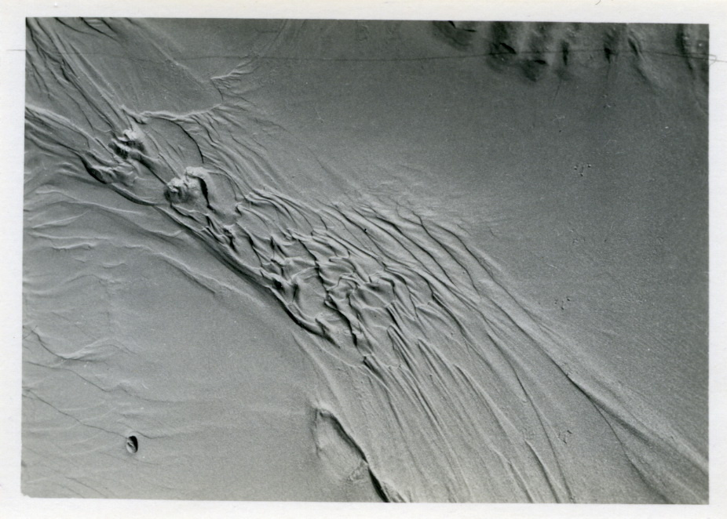
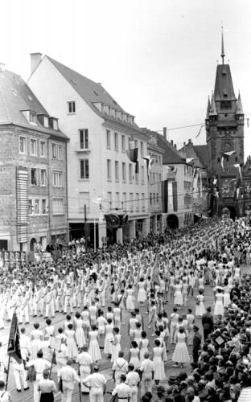

# AI exploration 6

> 2025-10-14

## OCR-DFDD

Example on 250000 photos from Deutsche Fotothek (SLUB Dresden).

Run a captioning and tagging prompt and build a small search application on top
of that data. Make classic and new queries possible, like search in text in
images, or search for sitatuation.



```
$ OLLAMA_HOST=http://colma:11434 ollama run qwen2.5vl:latest 'you are librarian
and you will briefly describe this photo, caption and tags:
./data/fotothek.slub-dresden.de/fotos/aes/wat/0000000/aes_wat_0000319.jpg --
follow a strict structure of the output: at most two sentence summary then one
newline than up to 5 tags that can come from bibliographic rule system, or can
be folksonomy style tags; do not repeat any tag'

Added image './data/fotothek.slub-dresden.de/fotos/aes/wat/0000000/aes_wat_0000319.jpg'

This black and white photograph captures the intricate patterns of sand dunes,
showcasing the natural textures and forms created by wind and water erosion.
The image highlights the dynamic and ever-changing nature of desert landscapes.

sand dunes, erosion, desert, black and white, natural textures

```

Another example, running on an N150, taking 1m12s; 45KB file.




```
$ OLLAMA_HOST=http://colma:11434 ollama run --verbose qwen2.5vl:latest 'you are
librarian and you will briefly describe this photo, caption and tags:
./data/fotothek.slub-dresden.de/fotos/fg/sta/1041000/fg_sta_1041134.jpg --
follow a strict structure of the output: at most two sentence summary then one
newline than up to 5 tags that can come from bibliographic rule system, or can
be folksonomy style tags; do not repeat any tag'

Added image './data/fotothek.slub-dresden.de/fotos/fg/sta/1041000/fg_sta_1041134.jpg'

A large group of people in white uniforms marching in a parade, with a historic
building and tower in the background.

parade, uniformed marchers, historic architecture, public event, historical
photo

total duration:       1m12.21731794s
load duration:        377.119938ms
prompt eval count:    289 token(s)
prompt eval duration: 1m2.742165053s
prompt eval rate:     4.61 tokens/s
eval count:           41 token(s)
eval duration:        9.096797295s
eval rate:            4.51 tokens/s
```
