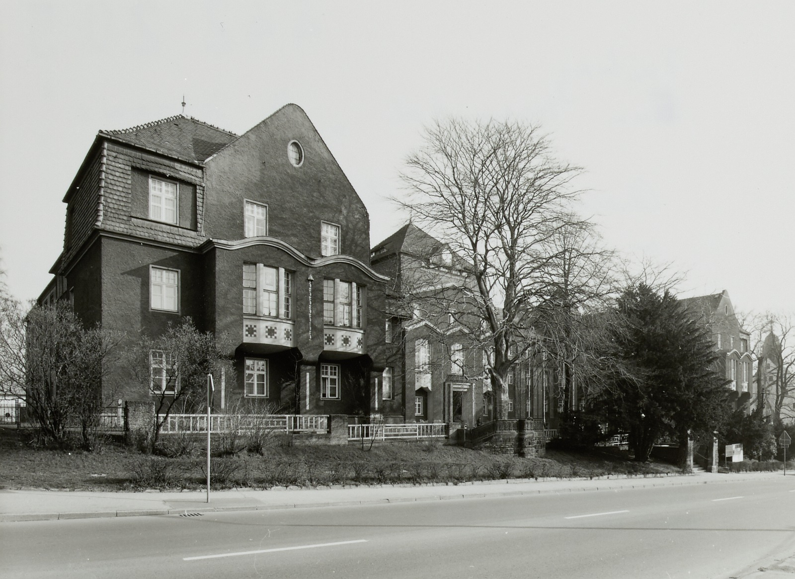
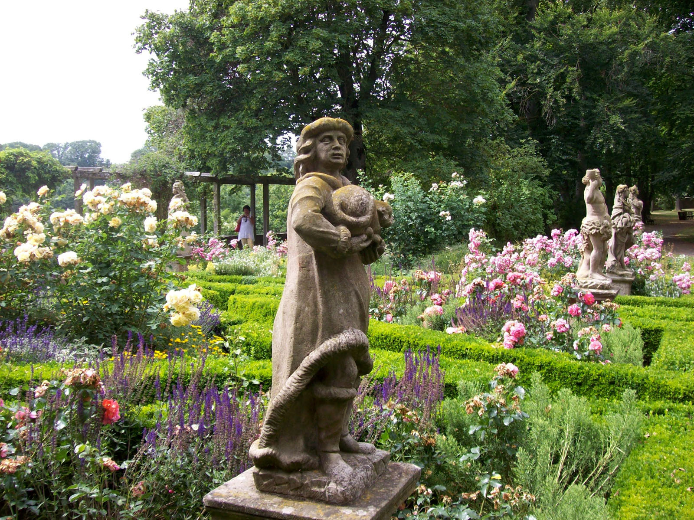
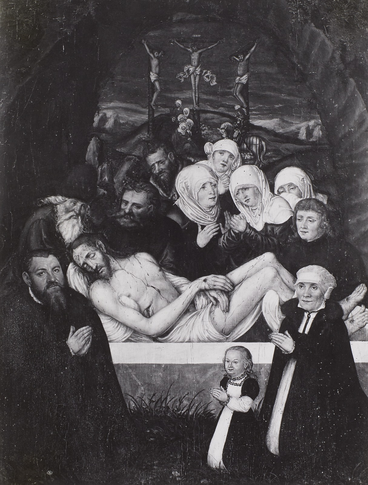

# AI exploration 6

> 2025-10-14

## Overview

* OCR-DFDD
* I2MD


## OCR-DFDD

Example on 250000 photos from Deutsche Fotothek (SLUB Dresden).

Run a captioning and tagging prompt and build a small search application on top
of that data. Make classic and new queries possible, like search in text in
images, or search for sitatuation.


```
$ OLLAMA_HOST=http://colma:11434 ollama run qwen2.5vl:latest 'you are librarian
and you will briefly describe this photo, caption and tags:
./data/fotothek.slub-dresden.de/fotos/aes/wat/0000000/aes_wat_0000319.jpg --
follow a strict structure of the output: at most two sentence summary then one
newline than up to 5 tags that can come from bibliographic rule system, or can
be folksonomy style tags; do not repeat any tag'

Added image './data/fotothek.slub-dresden.de/fotos/aes/wat/0000000/aes_wat_0000319.jpg'

This black and white photograph captures the intricate patterns of sand dunes,
showcasing the natural textures and forms created by wind and water erosion.
The image highlights the dynamic and ever-changing nature of desert landscapes.

sand dunes, erosion, desert, black and white, natural textures

```

Another example, running on an N150, taking 1m12s; 45KB file.


```
$ OLLAMA_HOST=http://colma:11434 ollama run --verbose qwen2.5vl:latest 'you are
librarian and you will briefly describe this photo, caption and tags:
./data/fotothek.slub-dresden.de/fotos/fg/sta/1041000/fg_sta_1041134.jpg --
follow a strict structure of the output: at most two sentence summary then one
newline than up to 5 tags that can come from bibliographic rule system, or can
be folksonomy style tags; do not repeat any tag'

Added image './data/fotothek.slub-dresden.de/fotos/fg/sta/1041000/fg_sta_1041134.jpg'

A large group of people in white uniforms marching in a parade, with a historic
building and tower in the background.

parade, uniformed marchers, historic architecture, public event, historical
photo

total duration:       1m12.21731794s
load duration:        377.119938ms
prompt eval count:    289 token(s)
prompt eval duration: 1m2.742165053s
prompt eval rate:     4.61 tokens/s
eval count:           41 token(s)
eval duration:        9.096797295s
eval rate:            4.51 tokens/s
```

Another, running on a GPU in less than 5 seconds.



```
$ OLLAMA_HOST=http://k9:11434 ollama run --verbose qwen2.5vl:latest 'you are
librarian and you will briefly describe this photo, caption and tags:
./data/fotothek.slub-dresden.de/fotos/df/hauptkatalog/0442000/df_hauptkatalog_0442205.jpg
-- follow a strict structure of the output: at most two sentence summary then
one newline than up to 5 tags that can come from bibliographic rule system, or
can be folksonomy style tags; do not repeat any tag'

Added image './data/fotothek.slub-dresden.de/fotos/df/hauptkatalog/0442000/df_hauptkatalog_0442205.jpg'

This black and white photograph depicts a large, multi-story building with a
distinctive architectural style, featuring a prominent gabled roof and
decorative elements on the facade. The building is situated on a street with a
sidewalk and a road in the foreground, surrounded by trees and a fence. The
image appears to be historical, possibly from the early to mid-20th century.

building, architecture, historical, street, urban

total duration:       56.005246954s
load duration:        51.013481731s
prompt eval count:    1321 token(s)
prompt eval duration: 3.21187807s
prompt eval rate:     411.29 tokens/s
eval count:           84 token(s)
eval duration:        1.769526142s
eval rate:            47.47 tokens/s
```

Another example.



```
$ OLLAMA_HOST=http://k9:11434 ollama run --verbose qwen2.5vl:latest 'you are
librarian and you will briefly describe this photo, caption and tags:
./data/fotothek.slub-dresden.de/fotos/tu/kg/0193000/tu_kg_0193532.jpg -- follow
a strict structure of the output: at most two sentence summary then one newline
than up to 5 tags that can come from bibliographic rule system, or can be
folksonomy style tags; do not repeat any tag'

Added image './data/fotothek.slub-dresden.de/fotos/tu/kg/0193000/tu_kg_0193532.jpg'

A serene garden scene featuring a statue of a man holding a snake, surrounded
by blooming flowers and lush greenery. In the background, another statue and a
person walking can be seen.

garden statue, sculpture, floral garden, nature, outdoor scene

total duration:       1m44.701742558s
load duration:        1m40.330187047s
prompt eval count:    1321 token(s)
prompt eval duration: 3.241373439s
prompt eval rate:     407.54 tokens/s
eval count:           53 token(s)
eval duration:        1.117964982s
eval rate:            47.41 tokens/s
```

Christianity.



```
$ OLLAMA_HOST=http://k9:11434 ollama run --verbose qwen2.5vl:latest 'you are
librarian and you will briefly describe this photo, caption and tags:
./data/fotothek.slub-dresden.de/fotos/df/hauptkatalog/0121000/df_hauptkatalog_0121110.jpg
-- follow a strict structure of the output: at most two sentence summary then
one newline than up to 5 tags that can come from bibliographic rule system, or
can be folksonomy style tags; do not repeat any tag; if the image depicts a
christian motiv, try to take your time and identify individuals in the image,
or estimate their age, determine if it is a woman, man or child, and what
expression can be seen in their posture or faces'

Added image './data/fotothek.slub-dresden.de/fotos/df/hauptkatalog/0121000/df_hauptkatalog_0121110.jpg'

This painting depicts the scene of the Lamentation of Christ, with figures
mourning the crucified Christ. The central figure, Jesus, is shown lying on a
stone, surrounded by mourners, including women and men, who display expressions
of grief and sorrow. The painting is rendered in a dark, somber palette,
emphasizing the solemnity of the moment.

tags: Christian art, Lamentation of Christ, Renaissance art, religious
painting, mourning figures

total duration:       42.293783787s
load duration:        36.901590794s
prompt eval count:    1410 token(s)
prompt eval duration: 3.42005799s
prompt eval rate:     412.27 tokens/s
eval count:           92 token(s)
eval duration:        1.961224296s
eval rate:            46.91 tokens/s
```


### Tag accuracy

The tags are free form, but they could be mapped to some more formal system. An
automatic system cannot research, where a photo was take, its provenience, and
all the tiny details that require an agent in the world.

* [Einführung in Erschließung und Metadaten](https://www.germanistik.uni-wuerzburg.de/fileadmin/_migrated/content_uploads/Skript-Erschliessung_und_Metadaten.pdf)

## I2MD (image to metadata)

Task: Take an image of the first pages of a book, structure the data, create structured metadata for human review.

* [ ] create evaluation set (image, metadata) pairs, maybe 1000 books, across the year (new books will have metadata supplied)
* [ ] evaluate off the shelf model
* [ ] try to tweak the prompt
* [ ] use a lora vision to text tuned model
* [ ] run evaluations again


### Summary

The captioning can add another layer for search, that can be accessed by a
semantic search layer that can exploit similarity from query and captioning
document.

One essential drawback is the models dependence on pixels. It is hard to
imagine a model, given a picture, could on its own research to access the right
data or ask the right questions.

It is bound by the data, here: an image. While it may help to improve search
for sitations, "a women pilot standing on an airfield", it is debatable if an
increase in recall is accompanied by a less valuable decrease in precision.

There are some stranger queries that may be useful. Depictions of christianity
may exhibit a broad, but limited number of personas, that are repeatedly seen
in painting. It also may be that we already have all the metadata we need, it
is just not that we have a search query that says, please return all pictures
of Franciscus, etc.

## ArticleSegmentation (AS)

Some conference proceeding contain multiple article per PDF. Try to find
accurate boundaries. Also often in review collections (multiple per page).

## SciDocClass (scientific document classification)

Is this document scientificly relevant? Given a PDF, output a yes, or no or a
confidence score.

