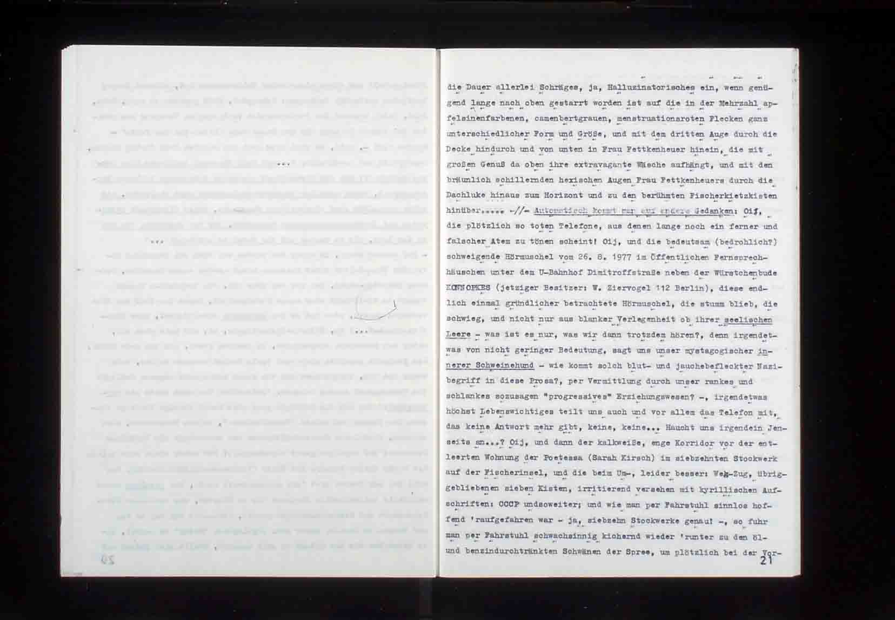

# AI exploration 6

> 2025-10-14

## Overview

* OCR-DFDD
* I2MD


## OCR-DFDD

Example on 250000 photos from Deutsche Fotothek (SLUB Dresden).

Run a captioning and tagging prompt and build a small search application on top
of that data. Make classic and new queries possible, like search in text in
images, or search for sitatuation.


```
$ OLLAMA_HOST=http://colma:11434 ollama run qwen2.5vl:latest 'you are librarian
and you will briefly describe this photo, caption and tags:
./data/fotothek.slub-dresden.de/fotos/aes/wat/0000000/aes_wat_0000319.jpg --
follow a strict structure of the output: at most two sentence summary then one
newline than up to 5 tags that can come from bibliographic rule system, or can
be folksonomy style tags; do not repeat any tag'

Added image './data/fotothek.slub-dresden.de/fotos/aes/wat/0000000/aes_wat_0000319.jpg'

This black and white photograph captures the intricate patterns of sand dunes,
showcasing the natural textures and forms created by wind and water erosion.
The image highlights the dynamic and ever-changing nature of desert landscapes.

sand dunes, erosion, desert, black and white, natural textures

```

Another example, running on an N150, taking 1m12s; 45KB file.


```
$ OLLAMA_HOST=http://colma:11434 ollama run --verbose qwen2.5vl:latest 'you are
librarian and you will briefly describe this photo, caption and tags:
./data/fotothek.slub-dresden.de/fotos/fg/sta/1041000/fg_sta_1041134.jpg --
follow a strict structure of the output: at most two sentence summary then one
newline than up to 5 tags that can come from bibliographic rule system, or can
be folksonomy style tags; do not repeat any tag'

Added image './data/fotothek.slub-dresden.de/fotos/fg/sta/1041000/fg_sta_1041134.jpg'

A large group of people in white uniforms marching in a parade, with a historic
building and tower in the background.

parade, uniformed marchers, historic architecture, public event, historical
photo

total duration:       1m12.21731794s
load duration:        377.119938ms
prompt eval count:    289 token(s)
prompt eval duration: 1m2.742165053s
prompt eval rate:     4.61 tokens/s
eval count:           41 token(s)
eval duration:        9.096797295s
eval rate:            4.51 tokens/s
```

Another, running on a GPU in less than 5 seconds.


```
$ OLLAMA_HOST=http://k9:11434 ollama run --verbose qwen2.5vl:latest 'you are
librarian and you will briefly describe this photo, caption and tags:
./data/fotothek.slub-dresden.de/fotos/df/hauptkatalog/0442000/df_hauptkatalog_0442205.jpg
-- follow a strict structure of the output: at most two sentence summary then
one newline than up to 5 tags that can come from bibliographic rule system, or
can be folksonomy style tags; do not repeat any tag'

Added image './data/fotothek.slub-dresden.de/fotos/df/hauptkatalog/0442000/df_hauptkatalog_0442205.jpg'

This black and white photograph depicts a large, multi-story building with a
distinctive architectural style, featuring a prominent gabled roof and
decorative elements on the facade. The building is situated on a street with a
sidewalk and a road in the foreground, surrounded by trees and a fence. The
image appears to be historical, possibly from the early to mid-20th century.

building, architecture, historical, street, urban

total duration:       56.005246954s
load duration:        51.013481731s
prompt eval count:    1321 token(s)
prompt eval duration: 3.21187807s
prompt eval rate:     411.29 tokens/s
eval count:           84 token(s)
eval duration:        1.769526142s
eval rate:            47.47 tokens/s
```

Another example.


```
$ OLLAMA_HOST=http://k9:11434 ollama run --verbose qwen2.5vl:latest 'you are
librarian and you will briefly describe this photo, caption and tags:
./data/fotothek.slub-dresden.de/fotos/tu/kg/0193000/tu_kg_0193532.jpg -- follow
a strict structure of the output: at most two sentence summary then one newline
than up to 5 tags that can come from bibliographic rule system, or can be
folksonomy style tags; do not repeat any tag'

Added image './data/fotothek.slub-dresden.de/fotos/tu/kg/0193000/tu_kg_0193532.jpg'

A serene garden scene featuring a statue of a man holding a snake, surrounded
by blooming flowers and lush greenery. In the background, another statue and a
person walking can be seen.

garden statue, sculpture, floral garden, nature, outdoor scene

total duration:       1m44.701742558s
load duration:        1m40.330187047s
prompt eval count:    1321 token(s)
prompt eval duration: 3.241373439s
prompt eval rate:     407.54 tokens/s
eval count:           53 token(s)
eval duration:        1.117964982s
eval rate:            47.41 tokens/s
```

Christianity.


```
$ OLLAMA_HOST=http://k9:11434 ollama run --verbose qwen2.5vl:latest 'you are
librarian and you will briefly describe this photo, caption and tags:
./data/fotothek.slub-dresden.de/fotos/df/hauptkatalog/0121000/df_hauptkatalog_0121110.jpg
-- follow a strict structure of the output: at most two sentence summary then
one newline than up to 5 tags that can come from bibliographic rule system, or
can be folksonomy style tags; do not repeat any tag; if the image depicts a
christian motiv, try to take your time and identify individuals in the image,
or estimate their age, determine if it is a woman, man or child, and what
expression can be seen in their posture or faces'

Added image './data/fotothek.slub-dresden.de/fotos/df/hauptkatalog/0121000/df_hauptkatalog_0121110.jpg'

This painting depicts the scene of the Lamentation of Christ, with figures
mourning the crucified Christ. The central figure, Jesus, is shown lying on a
stone, surrounded by mourners, including women and men, who display expressions
of grief and sorrow. The painting is rendered in a dark, somber palette,
emphasizing the solemnity of the moment.

tags: Christian art, Lamentation of Christ, Renaissance art, religious
painting, mourning figures

total duration:       42.293783787s
load duration:        36.901590794s
prompt eval count:    1410 token(s)
prompt eval duration: 3.42005799s
prompt eval rate:     412.27 tokens/s
eval count:           92 token(s)
eval duration:        1.961224296s
eval rate:            46.91 tokens/s
```

Plain text, with a slightly off prompt.



```
$ OLLAMA_HOST=http://k9:11434 ollama run --verbose qwen2.5vl:latest 'you are
librarian and you will briefly describe this photo, caption and tags:
./data/fotothek.slub-dresden.de/fotos/df/kz/0240000/df_kz_0240022.jpg -- follow
a strict structure of the output: at most two sentence summary then one newline
than up to 5 tags that can come from bibliographic rule system, or can be
folksonomy style tags; do not repeat any tag; if the image contains text,
extract the text'

Added image
'./data/fotothek.slub-dresden.de/fotos/df/kz/0240000/df_kz_0240022.jpg'

The image shows an open book with German text on the pages. The text appears to
be a narrative or descriptive passage, possibly from a literary work or a
historical document. The page numbers and some annotations are visible at the
bottom of the pages.

Tags: German text, book, narrative, literary work, historical document

total duration:       45.131263939s
load duration:        40.65036728s
prompt eval count:    1319 token(s)
prompt eval duration: 3.119131295s
prompt eval rate:     422.87 tokens/s
eval count:           64 token(s)
eval duration:        1.358618034s
eval rate:            47.11 tokens/s
```

More ocr prompt.

```
$ OLLAMA_HOST=http://k9:11434 ollama run --verbose qwen2.5vl:latest 'extract
all text: ./data/fotothek.slub-dresden.de/fotos/df/kz/0240000/df_kz_0240022.jpg
if the image contains text, extract the text'

Added image './data/fotothek.slub-dresden.de/fotos/df/kz/0240000/df_kz_0240022.jpg'

The text in the image is as follows:

die Dauer allerlei Schränges, ja, Halluzinatorisches ein, wenn genügend lange
nach oben gestarrt worden ist auf die in der Mehrzahl apfelrainenfarbenen,
omenertbräunen, menstruationaroten Flecken gern unterschiedlicher Form und
Größe, und mit dem dritten Auge durch die Decke hinduroh und von unten in Frau
Fettkenheuer hinein, die mit großem Genuss da oben ihre extravagante Wäsche
aufhängt, und mit dem dritten Auge Frau Fettkenheuer durch die Dachluke hinaus
zum Horizont und zu den berühmten Fischerkietzkisten hinüber.****// Automatisch
korrigiert nur auf ergrößerte Gedanken: Oij, die plötzlich so toten Telefone,
aus denen lange noch ein ferner und bräunlich schillernden hexischen Augen Frau
Fettkenheuers durch die Dachluke hinaus zum Horizont und zu den berühmten
Fischerkietzkisten hinüber,****// Automatisch korrigiert nur auf ergrößerte
Gedanken: Oij, und die bedeutsam (bedrohlich) schweigende Hörnuscheil von 26.
8. 1977 im öffentlichen Fernsprechhüschen unter dem U-Bahnhof Dimitroffstraße
   neben der Würstchenbude (jetziger Besitzer: W. Ziervogel 112 Berlin), diese
endlich einmal gründlicher betrachtete Hörnuscheil, die gestillt blieb, die
schwieg, und nicht nur aus blanker Verlegenheit ob ihrer geistlichen Leere -
was ist es nur, was wir dann trotzdem hören? denn irgend etwas von nicht
geringer Bedeutung, sagt uns unser mystagogischer in-nerer Schweinehund - wie
kommt solch blut- und jauhebefleckter Nazi-begriff in diese Prosa? per
Vermittlung durch unser rankes und schlankes sozusagen "progressives"
Erziehungswesen? - irgendeinwas teilt uns uns auch und vor allen das Telefon
mit, das keine Antwort mehr gibt, keine, keine, keine. Haupts uns uns die
Wohnung der Postesssa (Sarah Kirsch) im siebenten Stockwerkwerk der entleerten
Wohnung der Postesssa (Sarah Kirsch) im siebenten Stockwerkwerk genau, so fuhr
auf der Fischerinsel, und die beim U-B, leider besser: Wem-Zug,
übriggebliebenen sieben Kisten, irritierend versehen mit kyrillischen
Aufschriften: COOP undsoweter; und wie man per Fahrstuhl sinnoislich hoffend
'raufgefahren war - ja, siebenten Stockwerke genau -, so fuhr man per Fahrstuhl
schwachszinnig kichernd wieder 'runter zu den öl- und bensindurotrinkten
Schwänen der Spree, um plötzlich bei der Vor-

total duration:       28.537197838s
load duration:        10.245812428s
prompt eval count:    1261 token(s)
prompt eval duration: 3.088730445s
prompt eval rate:     408.26 tokens/s
eval count:           707 token(s)
eval duration:        15.198169622s
eval rate:            46.52 tokens/s
```


### Tag accuracy

The tags are free form, but they could be mapped to some more formal system. An
automatic system cannot research, where a photo was take, its provenience, and
all the tiny details that require an agent in the world.

* [Einführung in Erschließung und Metadaten](https://www.germanistik.uni-wuerzburg.de/fileadmin/_migrated/content_uploads/Skript-Erschliessung_und_Metadaten.pdf)

### Summary

The captioning can add another layer for search, that can be accessed by a
semantic search layer that can exploit similarity from query and captioning
document.

One essential drawback is the models dependence on pixels. It is hard to
imagine a model, given a picture, could on its own research to access the right
data or ask the right questions.

It is bound by the data, here: an image. While it may help to improve search
for sitations, "a women pilot standing on an airfield", it is debatable if an
increase in recall is accompanied by a less valuable decrease in precision.

There are some stranger queries that may be useful. Depictions of christianity
may exhibit a broad, but limited number of personas, that are repeatedly seen
in painting. It also may be that we already have all the metadata we need, it
is just not that we have a search query that says, please return all pictures
of Franciscus, etc.

What would be a good result? How would we evaluate that? Would we need human
labelled images? Are there human labelled images to train. Like in art history
books, where the first part of an essay on an image is an actual description of
an image? Las Meninas, Foucault.

> Die Meninas sind das sichtbare Bild des unsichtbaren Denkens von Velasquez. -- [


## I2MD (image to metadata)

Task: Take an image of the first pages of a book, structure the data, create structured metadata for human review.

* [ ] create evaluation set (image, metadata) pairs, maybe 1000 books, across the year (new books will have metadata supplied)
* [ ] evaluate off the shelf model
* [ ] try to tweak the prompt
* [ ] use a lora vision to text tuned model
* [ ] run evaluations again


## ArticleSegmentation (AS)

Some conference proceeding contain multiple article per PDF. Try to find
accurate boundaries. Also often in review collections (multiple per page).

## SciDocClass (scientific document classification)

Is this document scientificly relevant? Given a PDF, output a yes, or no or a
confidence score.

